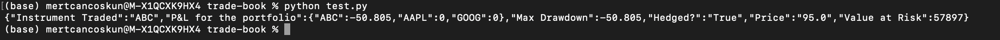

# FastAPI based Trade Book 

FastAPI based Trade Book implementation with multiple features like hedging, stop-loss, VaR calculation, P&L, Sharpe ratio and Max Drawdown calculations. Risk management parameters and initial prices & positions are read from PostgreSQL database in order to build the TradeBook class. After the client order is added, the database of prices and positions are updated and statistics are displayed. 

When managing a trading book with instruments, initial positions and prices at the beginning of the day, you will trade with clients and the positions will be changed. 
A premium is charged from the clients so the traded price might not be the same as the market.

TradeBook class deals with the trade activities and calculates real-time statistics. It is initialized with the initial positions and initial market prices. Some of its functions are as follows:

- **add_client_order** – with argument as an instance of ClientOrder.
- **update_market_price** – with argument as an instance of MarketUpdate.
- **get_pnl** – returns the accumulated Profit &amp; Loss (P&amp;L) from the start of the day.
- **get_maximum_drawdown** – returns the maximum drawdown from the start of the day.
- **calculate_sharpe_ratio** – returns the sharpe ratio of the portfolio.

Since the prices change rapidly during the day, instead of just holding your positions, one will liquidate the position in the market, but with some transaction cost for instrument as a fixed proportion of quantity.

Assuming the trades can be executed immediately after a **client order**, P&L and Max Drawdown are changed to reflect this strategy (with or without hedge).

It is assumed that the client order and hedge happen simultaneously, so P&L is not changed before and after the hedge. 

PostgreSQL used as database. 

Test results:

